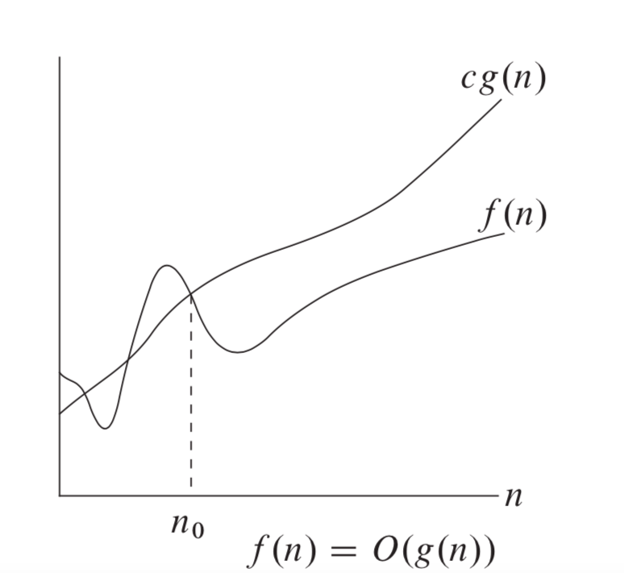
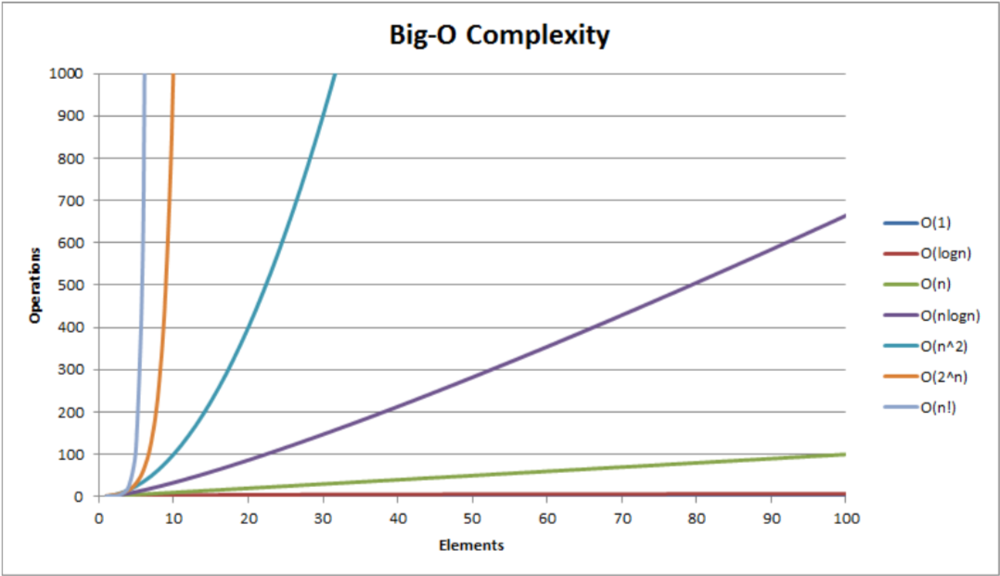
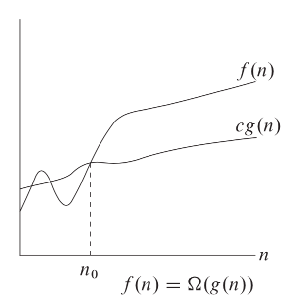
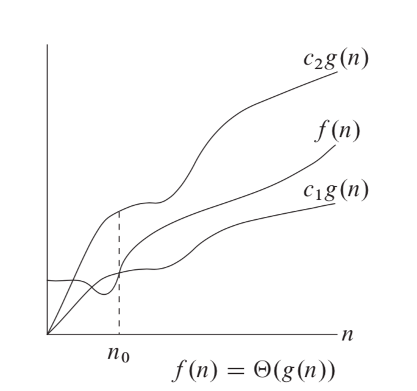
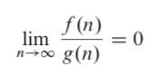
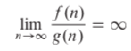
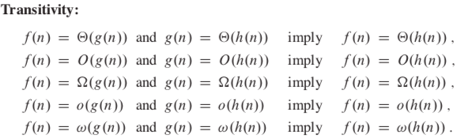
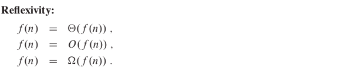
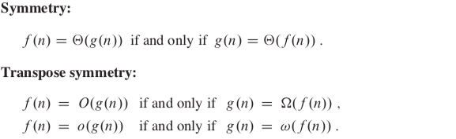

#### Recap
1. Data structures are used for storing data and organizing data in a way such that the required operations like sorting, inserting can be performed efficiently.
2. An algorithm is a finite set of instructions designed to perform a specific task.
3. Data structures and algorithms together make a program.

### Complexity Analysis
There are two types of complexity we analyze when we design an algorithm  -
1. Time Complexity tells us how much time an algorithm takes to complete.
2. Space Complexity tells us how much storage does this algorithm need for completion.

#### Kinds of time complexity analysis -
##### 1. Worst case
- upper bound on running time for *any* input. 
- T(n) = maximum time of an algorithm on any input of size **n**.

##### 2. Average case
- Expected running time over *all* inputs.
- T(n) = expected running time of an algorithm over all inputs of size **n**.

##### 3. Best case
- lower bound on running time for *any* input.
- T(n) = minimum time of an algorithm on any input of size **n**.

### Asymptotic Notations
Asymptotic notations are a very important part of this course and it will really haunt you (>_<) if you don't understand them properly. Most of us face difficulties at first in understanding asymptotic notations, in my case, I read class notes, [stack overflow](https://stackoverflow.com/questions/1364444/difference-between-big-o-and-little-o-notation), and [this book](https://github.com/CodeClub-JU/Introduction-to-Algorithms-CLRS/blob/master/Introduction%20to%20Algorithms%20-%203rd%20Edition.pdf) before my mid-semester exam to understand them. The issue is as we move on to the o (little-oh) and w (little-omega) notations, we get confused. So, I have summarised all I have learned from the above resources to explain in the best way possible.  Pay attention y'all or maybe take a break and come back with a fresh mind?

The asymptotic notations are of the following five types -
#### 1. O (Big-Oh) notation
O-notation, pronounced "big-oh notation", is used to describe the asymptotic upper bound of an algorithm. Formally, it is defined as:

For a given function, g(n) , we denote by O(g(n)) the set of functions,
O(g(n)) = { f(n): there exist **positive constants c and n0** such that
**0 <= f(n) <= c.g(n) for all n >= n0** }.

Some common O notations are -
1. O(1) - constant, independent of size n
2. O(log n) - logarithmic
3. O(n) - linear
4. O(nlogn) = O(logn!) - loglinear, quasilinear or linearithmic
5. O(n2) - quadratic
6. O(nc) - polynomial or algebraic
7. O(cn) where c > 1 - exponential
8. O(n!) - factorial

#### 2. Ω (Big-Omega) notation
Ω-notation, pronounced "big-omega notation", is used to describe the asymptotic lower bound of an algorithm. Formally, it is defined as:

For a given function, g(n), we denote by Ω(g(n)) the set of functions,
Ω(g(n)) = { f(n): there exist **positive constants c and n0** such that 
**0 <= c.g(n) <= f(n) for all n >= n0** }. 

#### 3. Θ (Theta) notation
We talked about O notation above. The disadvantage of describing the complexity of an algorithm in terms of O notation is that if we say that an algorithm runs in f(n)=O(n2), then that algorithm could actually run in n time.

Here comes the role of Θ notation. Usually, we want to be able to say that an algorithm runs no slower and no faster than a particular function. This is called a **tight bound**. Hence, we define Θ notation as -

For a given function, g(n), we denote by Θ(g(n)) the set of
functions
Θ(g(n)) = { f(n): there exist **positive constants c1 , c2 , and n0** such that **0 ≤ c1.g(n) <= f(n) <= c2.g(n) for all n >= n0** }.

#### 4. o (little-oh) notation

1. o-notation, pronounced little-oh notation, is used to denote a upper bound that is not **asymptotically tight**.
2. **Asymptotically tight**: We say a bound f(n) = O(g(n)) is asymptotically tight if f(n) = Θ(g(n)), that is, if also g(n) = O(f(n). The bound 2n2 = O(n2) is asymptotically tight as n2 = O(2n2) also hold, but the bound 2n = O(n2) is not as n2 != O(2n) because there is no c for which c.2n >= n2 for n>no. So 2n = o(n2) but 2n2 != o(n2).
3.  For a given function, g(n), we denote by o(g(n)) the set of functions
o(g(n)) = { f(n): for any positive constant **c > 0**, there exists a constant **n0 > 0 such that 0 <= f(n) < c.g(n) for all n >= n0** }.
4. The implication of this is that g(n) becomes insignificant relative to f(n) as n approaches infinity: 

So the main differences between Big O and small O are points 2 and 4 and the fact that there is no equality in the definition of little oh (in point 3, compare with the definition of Big O). Apart from these, some other differences (picked from [here](https://stackoverflow.com/questions/1364444/difference-between-big-o-and-little-o-notation)) are -
- In Big-O, it is only necessary that you find a particular multiplier c for which the inequality holds beyond some minimum n. In Little-o, it must be that there is a minimum x after which the inequality holds no matter how small you make c, as long as it is not negative or zero.
- Although somewhat counter-intuitively, Little-oh is the stronger statement. There is a much larger gap between the growth rates of f and g if f ∈ o(g) than if f ∈ O(g).
- One illustration of the disparity is this: f ∈ O(f) is true, but f ∈ o(f) is false.
- Therefore, Big-Oh can be read as "f ∈ O(g) means that f's asymptotic growth is no faster than g's", whereas little-o can be read as "f ∈ o(g) means that f's asymptotic growth is strictly slower than g's". It's like <= versus <.

#### 5. ω (little-omega) notation
1. ω-notation, pronounced little-omega notation, is used to denote a lower bound that is not asymptotically tight.
2. For a given function, g(n), we denote by ω(g(n)) the set of functions
ω(g(n)) = { f(n): for any positive constant **c > 0**, there exists a constant **n0 > 0 such that 0 <= c.g(n) < f(n) for all n >= n0** }.
3. The implication of this is that g(n) becomes insignificant relative to f(n) as n approaches infinity:

We can analyze the differences between little and big omega in a similar manner as done above.

Some relational properties of the notations are given below -

Thanks for bearing me, this was a long one for all of us. I hope you understood. If you have any doubts/suggestions/reviews, please let me know on [twitter](https://twitter.com/NikhilVatss). In the coming articles, we will use the notations described above, so if you are lost about what the use of these notations is, read the next article.