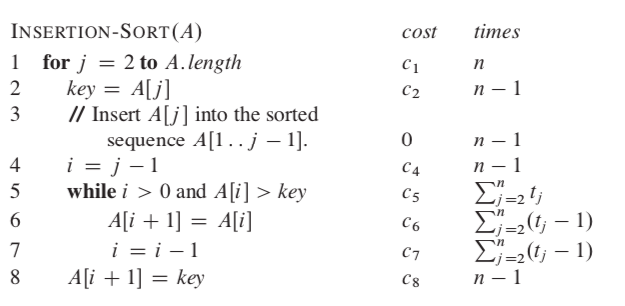
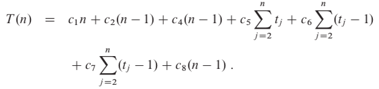
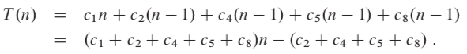
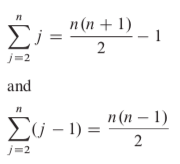
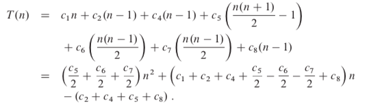

Hola, first things first, thanks for making it to this article. The last one was a tough one, no? Just for me? Okay then (^__^)!

#### Recap -
1. We analyze space and time complexity of an algorithm to see how efficient it is and whether we should go with it or design a new one according to our needs (the amount of data, the operations we need to perform and so on).

2. There are three kinds of analysis namely the worst case, best case, and average case.

3. There are five asymptotic notations - 
 - Big-Oh: upper bound of an algorithm
 - Big-Omega: lower bound of an algorithm
 - Theta: lower and upper bound (tight bound) of an algorithm 
 - Little-oh: upper bound that is not asymptotically tight
 - Little-omega: lower bound that is not asymptotically tight

### Insertion Sort
Sorting is a very common problem in Computer Science and is asked often in coding interviews and tests. As the name suggests, sorting basically means converting an unsorted input like [1,10,5,8,2] to a sorted output like [1,2,5,8,10], increasing order unless specified otherwise.

Insertion sort is a common way of sorting and is illustrated below -

<iframe width="560" height="315" src="https://www.youtube.com/embed/OGzPmgsI-pQ" frameborder="0" allow="accelerometer; autoplay; encrypted-media; gyroscope; picture-in-picture" allowfullscreen></iframe>

Credits - [GeeksForGeeks](https://www.geeksforgeeks.org/)
You probably know this but GfG is one of the best sources for learning many topics in Computer Science. So, if you ever feel stuck or if you have a doubt, go read the GfG article for that topic.

Now, let's go through the **pseudocode** for Insertion Sort but you may ask what is Pseudocode? Here you go. 

#### Pseudocode -
It is an informal way of writing programs that do not require any strict programming language syntax. We describe algorithms in Pseudocode so that people who know any programming language can understand it easily. One important point to note is that in pseudocode, index (of arrays, etc.) generally starts from 1 as opposed to 0 in programming languages. The pseudocode for Insertion Sort is -

1. **for j=2 to A.length**       
// *loop from second element till the end*
2.    **key=A[j]**               
// *store the current elem in a variable named **key***
3.    **i=j-1**
// *start from current position - 1*
4.    **while i>0 and A[i]>key**
// *loop until we reach the beginning of array or we find an element less than key (current element) in the sorted array*
5.       **A[i+1]=A[i]**
// *if condition in step above is true, shift the element right one place*
6.       **i=i-1**
// *go to the previous position, then go to step 4*
7.    **A[i+1]=key**
// *insert the current element at it's correct position in the sorted array*

That's it. Simple, eh? If you have any doubts, I would be happy to elaborate in the comments section.

Now, let's analyze the performance of insertion sort, using the concepts we learned in the previous article.

The cost for ith step is ci. The cost for any comment is 0 since it's not performed and is just for the programmer's understanding. Hence, insertion sort is essentially a seven-step algorithm.

Now, steps 1, 2, 4 and 8 will run **n-1** times (from second to the last element). 

Step 5 will run tj times (assumption) for n-1 elements (second till last). Similarly, steps 6 and 7 will run tj-1 times for n-1 elements. They will run one less time because for each element - before line 8 is executed, while condition (step 5) is checked/executed but steps 6 and 7 ain't as the condition in while statement fails.

Summing up, the total cost for insertion sort is -

Now we analyze the best, worst and average case for Insertion Sort.

#### Best case -
The array is already sorted. tj will be 1 for each element as while condition will be checked once and fail because A[i] is not greater than **key**.

Hence cost for steps 1, 2, 4 and 8 will remain the same. Cost for step 5 will be n-1 and cost for step 6 and 7 will be 0 as tj-1 = 1-1 = 0. So cost for best case is - 

We can express this running time as **an+b** where a and b are constants that depend on costs ci. Hence, running time is a linear function of size **n**, that is, the number of elements in the array.

#### Worst case -
The array is reverse sorted. tj will be j for each element as **key** will be compared with each element in the sorted array and hence, while condition will be checked j-1 times for comparing key with all elements in the sorted array plus one more time when i becomes 0 (after which i > 0 will fail, control goes to step 8).

The explanation for the first summation is simple - the sum of numbers from 1 to n is n(n+1)/2, since the summation starts from 2 and not 1, we subtract 1 from the result. We can simplify the second summation similarly by replacing n by n-1 in the first summation. 

We can express this worst-case running time as **an2+bn+c** where a, b and c are constants that depend on costs ci. Hence, running time is a quadratic function of size **n**, that is, the number of elements in the array.

#### Average case -
The average case running time is the same as the worst-case (a quadratic function of n). On average, half the elements in A[1..j-1]􏰂 are less than A[j] 􏰂, and half the elements are greater. On average, therefore, we check half of the subarray A[1..j-1], and so tj is about j/2. The resulting average-case running time turns out to be a quadratic function of the input size, just like the worst-case running time.

That's it for today. If you have any reviews/suggestions, please tell them on [twitter](https://twitter.com/NikhilVatss). In the next article, we will analyze merge sort and compare insertion sort with merge sort to realize how important complexity analysis is. 
