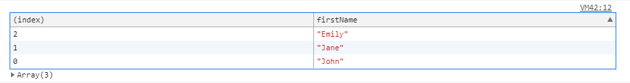
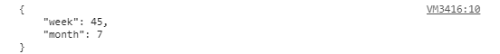

If you are a frontend developer, you must have spent a considerable amount of time looking at the structure of the complex nested data coming from backend. No one loves going to the browser's console and click on those tiny little arrows only to see 100s of lines of messy data. Read this post to increase your efficiency by learning two better ways of logging data to console.

Tip: Click an image to zoom in and out.

### 1. Using console.table()

You can use `console.table(data)` for pretty-printing the data (array of objects, an array of arrays) in the format of a table. 

Note that in Chrome `console.table(data)` may not work sometimes when the data is just an array of strings or numbers (data is not compound). In that case just use `console.table([data])`.

```
// Syntax - 
console.table(data [, columns])
```

The function takes two parameters - 
1. Data to be pretty-printed. [Mandatory]
2. An array containing the columns to be included in the output. [Optional]

Example - 

```
// an array of objects, logging only firstName

function Person(firstName, lastName) {
  this.firstName = firstName;
  this.lastName = lastName;
}

var john = new Person("John", "Smith");
var jane = new Person("Jane", "Doe");
var emily = new Person("Emily", "Jones");

console.table([john, jane, emily], ["firstName"]);
```

Result -


You can also sort the table in ascending or descending order of any field by clicking the arrow in the column headers. The upward arrow in the right corner of the second column indicates that the table is arranged based on the ascending order of first names.

Keep in mind that `console.table()` is not supported in IE.

### 2. Using console.log() with JSON.stringify()

You can also use `console.log(JSON.stringify(data, undefined, 4))` for pretty-printing the data with whitespaces for readability.

`JSON.stringify()` takes 3 parameters -

- The first parameter contains the data. [Mandatory]
- The second one is the replacer parameter which can be an array or a function. This parameter is used for filtering the properties of the object (ex - printing some selected fields only). [Optional]
- The third one is the number of spaces to improve the readability of data by formatting it. The max value can be 10. [Optional]

Example - 
```
function replacer(key, value) {
  // Filtering out properties
  if (typeof value !== 'string') {
    return undefined;
  }
  return value;
}

var foo = {foundation: 'Mozilla', model: 'box', week: 45, transport: 'car', month: 7};
console.log(JSON.stringify(foo, replacer,4));

// Alternatively we could have just used console.log(JSON.stringify(foo, ['week', 'month']));
```
